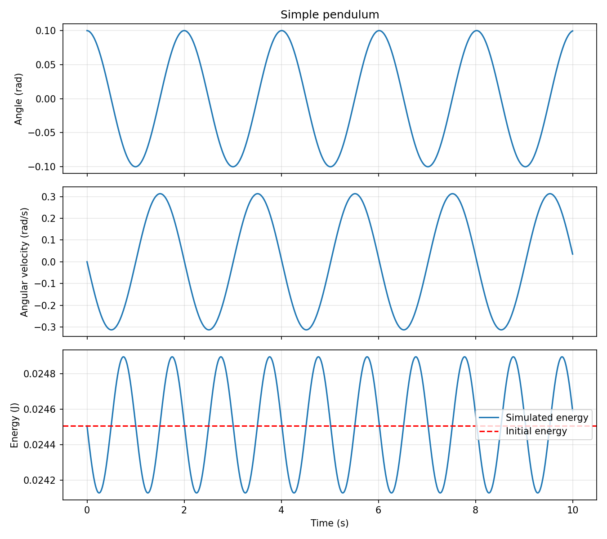

# Pendulum dynamics

A learning project exploring pendulum mechanics, numerical simulation and, eventually, machine-learning forecasts. Built in Python using a Jupyter notebook.

## Current progress

- [x] Simple-pendulum simulation using semi-implicit Euler integration.
- [x] Angle, angular velocity and total-energy plots.
- [x] Double-pendulum geometry and energy derivations.
- [x] Euler-Lagrange derivation of the coupled equations and acceleration formulas.
- [ ] Double-pendulum integration with SciPy `solve_ivp`.
- [ ] Numerical convergence and energy checks for the double pendulum.
- [ ] Animation of both rods and bobs.
- [ ] Generate trajectories and split them by trajectory before windowing.
- [ ] Compare forecasting baselines with an LSTM.
- [ ] Investigate noisy inputs and an energy-conservation loss.

There is no trained ML model or completed double-pendulum simulation yet.

## Run with Anaconda

Open Anaconda Prompt and navigate to this project folder:

```bat
cd /d "C:\Users\Muse PC\Downloads\planning\pendulum-dynamics"
conda env create -f environment.yml
conda activate pendulum-dynamics
jupyter notebook main.ipynb
```

The environment only needs to be created once. On subsequent visits, activate it and launch the notebook. Select its Python environment and use **Restart Kernel and Run All Cells** to reproduce the implemented sections.

Alternatively, in an existing Python environment:

```sh
python -m pip install -r requirements.txt
jupyter notebook main.ipynb
```

## Physics and numerical assumptions

- Point masses, massless rigid rods, a fixed pivot and no friction or air resistance.
- SI units: kilograms, metres, seconds and radians.
- Both double-pendulum angles are measured from vertically downwards, not relative to each other.
- The simple simulation uses the lowest point as zero potential energy; the double-pendulum derivation uses the fixed pivot. Constant energy offsets do not change the dynamics.
- Semi-implicit Euler has numerical energy error. A nearly constant energy plot is a useful check, not proof of an accurate trajectory. Timestep-convergence checks remain to be added.

## Files

- `main.ipynb`: code, plots and mathematical derivations.
- `environment.yml`: Anaconda environment.
- `requirements.txt`: dependencies for other Python environments.

SciPy is included for the next stage. PyTorch will be added when ML work begins.

## Saving future work

For an integrated Git sidebar, use JupyterLab. The supplied conda environment includes JupyterLab and its Git extension:

```sh
conda activate pendulum-dynamics
jupyter lab
```

Open this repository folder, then `main.ipynb`. Save the notebook, open the Git sidebar, review the changes, stage the intended files, enter a short commit message and commit. Push sends the committed changes to GitHub once a remote and authentication are configured. Commit saves history locally; push uploads it. Do not put passwords or access tokens in notebook cells.

## Verified simple-pendulum result



All existing code cells were executed in order with Python from Anaconda, NumPy 2.3.5 and Matplotlib 3.10.6. With the notebook's current parameters and 0.01-second timestep, 1,001 energy samples were recorded; maximum absolute deviation from initial energy was approximately 1.59% of the initial energy. This is a numerical error measurement, not an accuracy guarantee. Automated execution through a Jupyter kernel failed locally with a ZeroMQ error, so verification used a shared Python namespace and a non-interactive plotting backend instead.

Work in this copy of `main.ipynb` and save it in Jupyter. Saving the notebook does **not** upload it to GitHub. Commit and push changes separately, using GitHub Desktop or Git.

Keep generated datasets, model checkpoints and credentials out of the repository; the included `.gitignore` excludes common versions of these files.
